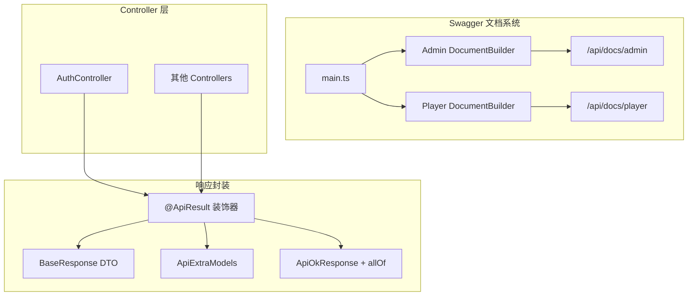
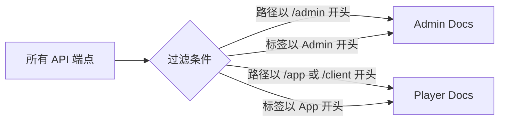

# 设计文档

## 概述

本设计文档描述了 NestJS 后端 Swagger 文档系统的重构方案。重构包含两个主要部分：

1. **文档拆分**: 将单一 Swagger 文档拆分为管理端和玩家端两个独立实例
2. **响应封装**: 实现 `@ApiResult` 装饰器，使 Swagger Schema 正确反映统一响应结构

## 架构

### 整体架构图



### 文档过滤流程



## 组件和接口

### 1. BaseResponse DTO

**文件路径**: `src/common/dto/base-response.dto.ts`

```typescript
import { ApiProperty } from '@nestjs/swagger';

export class BaseResponse<T> {
  @ApiProperty({ example: 200, description: '响应状态码' })
  code: number;

  @ApiProperty({ example: 'success', description: '响应消息' })
  message: string;

  @ApiProperty({ example: '2024-01-01T00:00:00.000Z', description: '时间戳' })
  timestamp: string;

  // data 字段不加 @ApiProperty，由装饰器动态处理
  data: T;
}
```

### 2. @ApiResult 装饰器

**文件路径**: `src/common/decorators/api-result.decorator.ts`

**接口定义**:
```typescript
function ApiResult<TModel extends Type<any>>(
  model: TModel, 
  isArray?: boolean
): MethodDecorator
```

**参数说明**:
- `model`: DTO 类，用于定义 `data` 字段的类型
- `isArray`: 可选，默认 `false`。为 `true` 时，`data` 字段为数组类型

**实现逻辑**:
1. 使用 `ApiExtraModels` 注册 `BaseResponse` 和传入的 `model`
2. 使用 `ApiOkResponse` 自定义 Schema
3. 使用 `allOf` 继承 `BaseResponse` 的基础字段
4. 根据 `isArray` 参数决定 `data` 字段的 Schema 结构

### 3. Swagger 文档配置

**文件路径**: `src/main.ts`

**Admin 文档配置**:
- 路径: `/api/docs/admin`
- 标题: "Admin API"
- 认证: 启用 Bearer Auth
- 过滤: 路径以 `/admin` 开头或标签以 `Admin` 开头

**Player 文档配置**:
- 路径: `/api/docs/player`
- 标题: "Player API"
- 过滤: 路径以 `/app` 或 `/client` 开头或标签以 `App` 开头

## 数据模型

### BaseResponse Schema

| 字段 | 类型 | 示例值 | 描述 |
|------|------|--------|------|
| code | number | 200 | 响应状态码 |
| message | string | "success" | 响应消息 |
| timestamp | string | "2024-01-01T00:00:00.000Z" | ISO 格式时间戳 |
| data | T | - | 泛型数据，由具体 DTO 定义 |

### Swagger Schema 输出示例

当使用 `@ApiResult(LoginResponseDto)` 时，生成的 Schema:

```json
{
  "allOf": [
    { "$ref": "#/components/schemas/BaseResponse" },
    {
      "properties": {
        "data": { "$ref": "#/components/schemas/LoginResponseDto" }
      }
    }
  ]
}
```

当使用 `@ApiResult(UserDto, true)` 时，生成的 Schema:

```json
{
  "allOf": [
    { "$ref": "#/components/schemas/BaseResponse" },
    {
      "properties": {
        "data": {
          "type": "array",
          "items": { "$ref": "#/components/schemas/UserDto" }
        }
      }
    }
  ]
}
```

## 正确性属性

*属性是系统在所有有效执行中应保持为真的特征或行为——本质上是关于系统应该做什么的形式化陈述。属性作为人类可读规范和机器可验证正确性保证之间的桥梁。*

### Property 1: 管理端文档过滤正确性

*对于任意* API 端点，如果其路径以 `/admin` 开头或其标签以 `Admin` 开头，则该端点应该出现在管理端 Swagger 文档中，且不应出现在玩家端文档中。

**Validates: Requirements 1.2**

### Property 2: 玩家端文档过滤正确性

*对于任意* API 端点，如果其路径以 `/app` 或 `/client` 开头或其标签以 `App` 开头，则该端点应该出现在玩家端 Swagger 文档中，且不应出现在管理端文档中。

**Validates: Requirements 1.5**

### Property 3: 数组类型响应 Schema 正确性

*对于任意* DTO 模型，当 `@ApiResult(model, true)` 应用时，生成的 Swagger Schema 中 `data` 字段应该是数组类型，且数组项引用该 DTO 模型。

**Validates: Requirements 2.9**

## 错误处理

### 装饰器错误处理

1. **无效模型**: 如果传入的 `model` 不是有效的类，装饰器应在编译时通过 TypeScript 类型检查捕获
2. **Schema 注册失败**: 如果 `ApiExtraModels` 注册失败，Swagger 文档生成时会抛出错误

### 文档生成错误处理

1. **过滤器无匹配**: 如果过滤条件没有匹配到任何端点，文档将显示空的 API 列表
2. **配置冲突**: 如果两个文档配置冲突，后配置的会覆盖先配置的

## 测试策略

### 单元测试

1. **BaseResponse DTO 测试**
   - 验证类结构正确
   - 验证 `@ApiProperty` 装饰器正确应用

2. **@ApiResult 装饰器测试**
   - 验证装饰器返回正确的元数据
   - 验证 `isArray` 参数正确处理
   - 验证 Schema 结构正确生成

### 属性测试

使用 `fast-check` 库进行属性测试：

1. **文档过滤属性测试**
   - 生成随机的路径和标签组合
   - 验证过滤函数对所有输入返回正确结果

2. **Schema 生成属性测试**
   - 生成随机的 DTO 模型配置
   - 验证生成的 Schema 结构符合预期

### 集成测试

1. **Swagger 文档访问测试**
   - 验证 `/api/docs/admin` 可访问
   - 验证 `/api/docs/player` 可访问
   - 验证文档内容正确过滤

2. **响应 Schema 验证测试**
   - 验证应用 `@ApiResult` 后的端点 Schema 包含 BaseResponse 结构
   - 验证 `data` 字段正确引用 DTO 模型

### 测试框架

- **单元测试**: Jest
- **属性测试**: fast-check
- **集成测试**: Jest + Supertest
